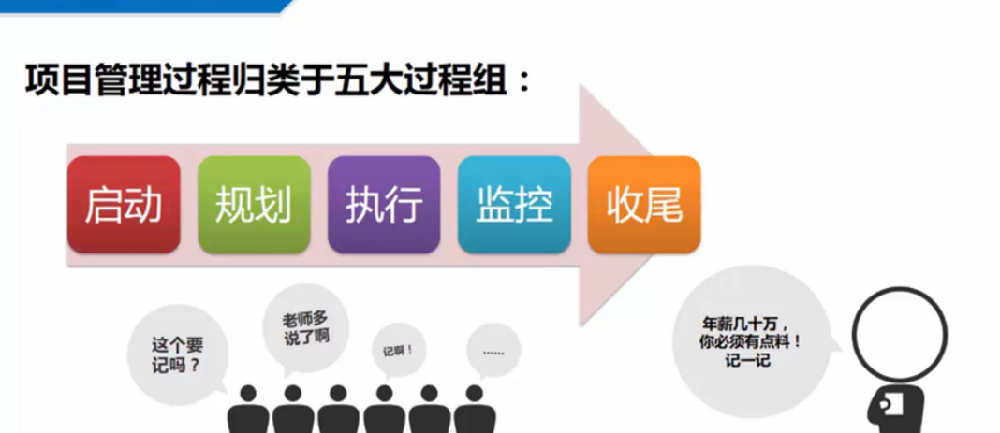
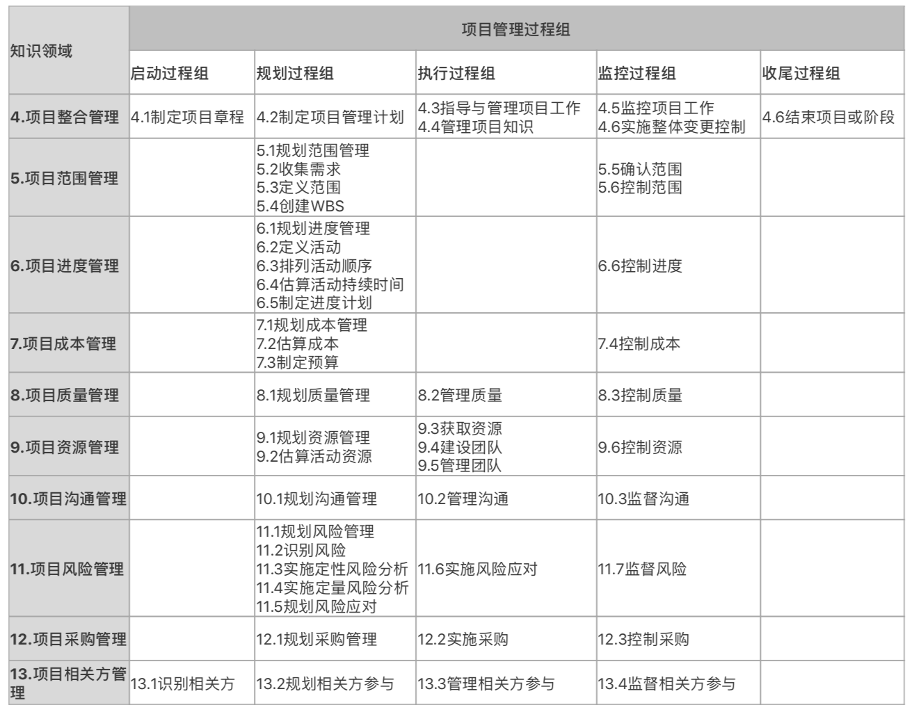

话说任何一个写程序的人都不可能干一辈子（有些人例外），大部分都是要转行的。

技术转管理是一条路，技术转创业是一条路，技术干销售是一条路，技术转售前是一条路，技术转啥呢。。。。

有些人走着走着就丢了，在前进的道路上再也找不到ta的影子啦。

回归正题，话说考pmp都是要报培训班的，楼主也不例外，报了XXX的培训班。

4月12和13号上了两天的大课（线下课，某酒店，封闭式，培训，洗脑？，灌输教程的知识）。

认识了班里的同学（做医药的、通信的、制造业的、航天卫星的。。。） 个个都是大牛（隔行如隔山，感觉好像很厉害的样子），我和我的小伙伴们都惊呆了，同九年汝河秀！

刷了刷书，系统了解项目管理的知识对人的认知还是有点作用的，书中自有黄金屋，书中自有颜如玉（这话不是我说的），古人都意识到了房子和钞票是多么重要！

项目管理有五大过程组和十大知识领域，四十九个过程。






温馨提示：以下内容仅供参考

```
一：项目管理概述：
(1) 不同项目有不同的制约因素，同一项目在不同阶段有不同的制约因素和目标。(一般
和个别原则);
(2) 项目型中项目经理权力最大，职能型中权力最小。矩阵中从弱到强，权力加大。
(3) 项目一开始风险最大，变更代价最小；项目后期风险变小，变更代价变大。
(4) 项目经理可以选择、控制的是组织过程资产，剩下的是事业环境因素。
(5) 协调员有一定权力，联络员无
(6) 五大过程组和十大知识领域,横向、纵向都要记住，常考的是做事的流程、顺序。

2．启动：
(1) 看到新项目、项目新阶段、新项目经理等，选项目章程。没有的话，项目经理可以
参与编写，但是要发起人来发布。
(2) 干系人要全部识别，重点管理，尽早参与。
(3) 项目是否值得投资，选商业论证
(4) 有任何人质疑项目经理、高层次的、概要性的描述，选项目章程。
(5) 章程内容，必须记住：三高二总，发干委，审假因目标
三高：高层级需求、高层级项目描述和边界定义、高层级风险
二总：总体里程碑进度、总体预算
发：发起人及批准章程人员姓名职权
干：干系人清单
委：委派的PM及权责
审：项目审批要求
假：假设条件和制约因素
因：项目目的和批准原因
目标：可测量的项目目标和成功标准

3．规划：
(1) 项目管理计划的制定是渐进明细的，根据项目的制约因素和特点来决定。
(2) 首先明确需求，然后确定范围，最后分解至工作包。看到工作内容和制约因素，想
到范围说明书。
(3) 关键路径不唯一，是历时最长的。总时差为零的是关键路径，关键路径上的活动浮
动时间为0
（选项常考问这个活动浮动时间，80%的答案都是0，首先判断是否在关键路径，很少让
你用7宫格去推……）。
(4) 看到资源数量有限、或只在特定时间可用、或资源负载太重，用资源平衡。
(5) 看到如果……就……选假设情景分析
(6) 进度压缩：赶工和快速跟进，看到并行和成本是首要制约因素选快速跟进，其他都
是赶工，CPI>1 SPI<1，然后CPI<1,SPI>1了，问发生了什么事：赶工！。
(7)自上而下(专家判断、类比、参数)，领导很忙、让PM快速估算：类比估算。
(8) 三点估算的计算公式、标准差和正态分布，默认都是贝塔分布。
(9) 储备分析：应急储备和管理储备
(10) 质量规划是制定标准，成本效益、质量成本、标杆对照、实验设计是专用。
(11) 看到规格，是质量测量指标。
(12) 看到有人对沟通不满意、出现争议的显现等，首先审查沟通管理计划，如果没有，
制定一个。PMP考题里，如出现”沟通管理计划“80%的时候都是首选答案！
(13) 看到有责任不清，选责任分配矩阵。
(14) 风险要走流程，就是识别、定性、定量分析和应对。
(15) 看到概率和影响相关的，优先排序的，待观察的就是定性分析。
(16) 看到决策、建模、敏感性分析，就是定量分析。
(17) 看到计算平均结果的统计方法，选预期货币价值分析。
(18) 看到采购中甲方希望风险小，选总价合同；看到没有范围选工料合同。
(19) 看到完全消除风险选回避；看到风险合同，选转移；看到降低概率，选减轻。
(20) 看到不知道变更找谁，选变更管理计划。
(21) 干系人管理计划要去除敏感信息。
(22) 看到制约因素，找：项目章程、范围说明
光环-独秀班
书、需求文件
(23) 积极风险：提高数量、开拓质量
(24) 冲突问题：

4．执行：
(1) 定时或随机使用、查看变更的效果，用质量审计。
(2) 看到项目还没有开始就有人了，这是预分配；项目人员要谈判。
(3) 团队建设五阶段：“争吵”，选震荡阶段；”开始建立信任“，选规范阶段；”像
一个有序的单位“，选成熟阶段。
(4) 冲突管理5 方法，看到有人撤选撤退；看到互相进退，选妥协；看到解决，选面
对；紧要关头选强制。
(5) 干系人对结果不满意，选管理干系人期望(管理干系人参与)，这时问依据什么，选
干系人管理策略(干系人管理计划)。
(6) 看到卖方不清楚，选投标人大会。
(7) 看到过程改进，选质量保证。

5．监控：
(1) 看到变更一定要走流程，根据当前的状况，选择流程中最合适的步骤。
(2) 挣值计算要会，EV，PV，AC。 SV = EV – PV， CV = EV – AC， ETC = BAC-EV
或（BAC-EV）/CPI， EAC = BAC – CV 或 BAC/CPI。
(3) 看到验收，选确认范围，看到验证，选质量控制。
(4) 看到过程稳定、有无失控、改进效果如何，选控制图
(5) 找根本原因选因果图、鱼骨图、石川图。
(6) 找两个变量之间的关系，看有无关系，选散点图。
(7) 找到最主要的原因，PM怎么做，用帕累托图
(8) 新风险用风险再评估，风险是否有效用风险审计，风险应对由风险管理员
(9) 采购变更用合同变更控制系统，避免卖方低绩效，用卖方绩效审查(采购绩效审
查)。
(10) 有干系人的任何变化，首先要更新干系人登记册。

6．收尾：
(1) 项目要进入收尾，必须有可交付成果的验收。
(2) 项目要收尾结束，必须要移交可交付成果。
(3) 项目结束要有组织过程资产的更新，经验教训的总结。
(4) 看到对采购过程的得失，或为未来采购，选采购审计。
(5)项目完成或终止，选“经验教训”
```
 