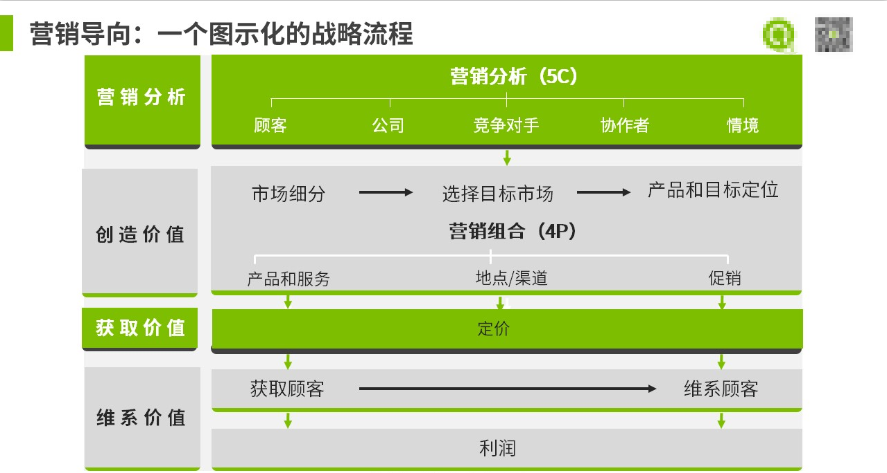

建立营销思维，帮助企业制定营销战略

首先需要弄明白几个概念

1.5C是什么？

答：顾客，资源能力，竞争者，协作者，情境

2.STP是什么？

答：市场细分（market  segmentation） ，选择目标市场 （targeting），产品和服务定位（positioning），这三个要素经常称为战略营销

3.4P是什么？

答：产品服务，渠道，促销，定位

综合这些概念如下图可以很好理解一个企业制定营销战略的时候大致参考有哪些关键性指标

