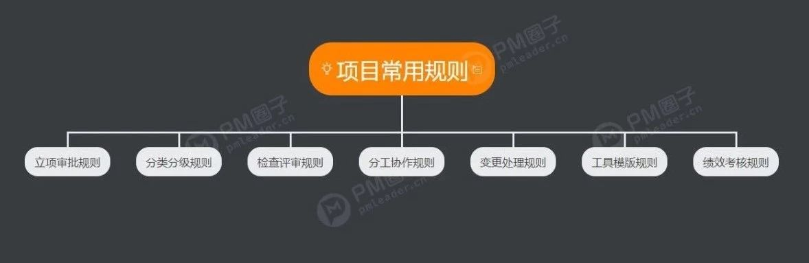
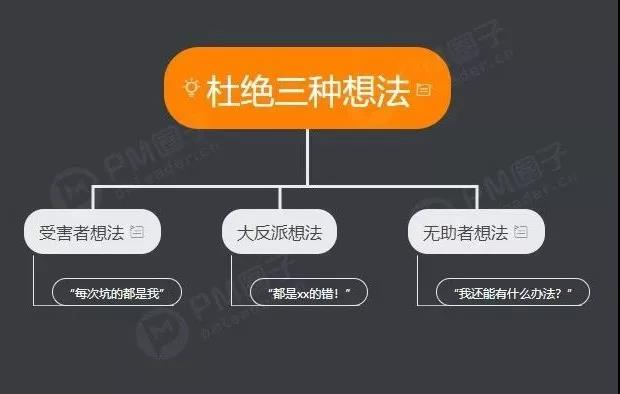
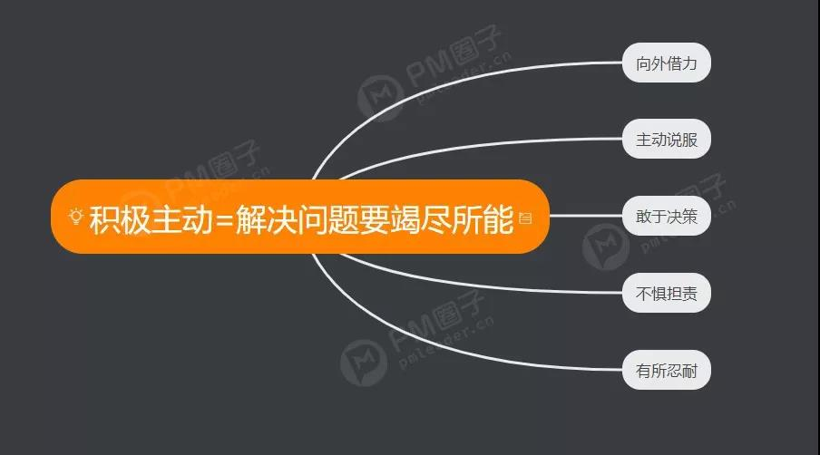
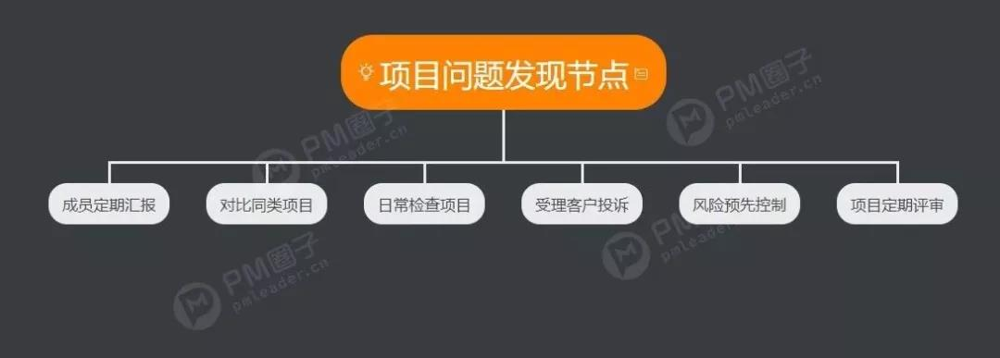
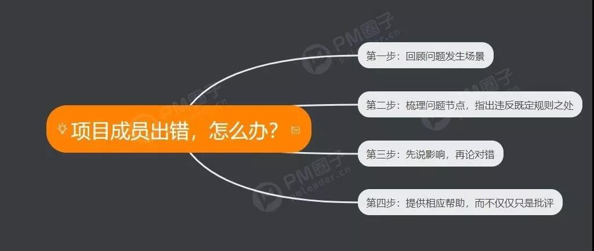
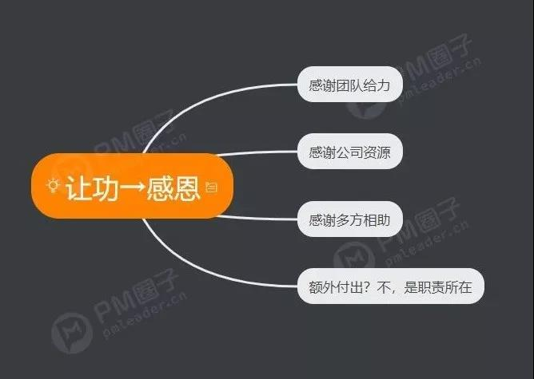
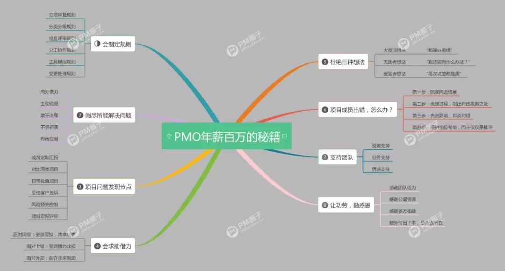

# 8张图总结年薪百万PMO的秘籍
很多项目经理重执行，懂技术，却因为缺少管理和战略方面的软技能，无法在组织中进一步攀升，成为薪资翻倍的PMO。


因此，以下8张思维模型图，既是精英级别的PMO必备的管理素养，也是写给升职遭遇瓶颈的项目经理的解决之道。


## 1 会求助借力
 


善于“求助”，是优秀管理者的主要特征。

表面上说的是求助，其实考验的是PMO的资源调配能力。不懂争取资源、利用资源的管理者，绝不会是优秀的管理者。

## 2 会制定规则



规则是为了提高效率，规避风险而存在的，绝不能成为束缚团队的繁文缛节。

## 3 会保持心态


PMO要有强大的抗压能力，保持好心态不能垮。

控制负面情绪的要点在于，避免主观臆断和过多的抱怨。多着眼于现实问题，能解决就解决，实在不能解决的，要学会放下。

## 4 会积极主动


眼界要高，身板儿要低。在工作中，PMO是打不死的小强，无论碰到任何问题，都坚持尝试一切手段去积极解决。

优秀的PMO懂得留退路，但绝不会选择逃避。

## 5 会监督过程


在什么节点，检查什么内容，才能最大程度地规避失误和风险，是PMO所需要不断思考和优化的。

## 6 会批评点醒


团队成员出现问题，PMO需要及时指出。但具体指出时应有所张弛，才不影响团队成员士气，同时也能体现管理者应有的个人魅力。

对于管理者来说，个人魅力来自于日常与团队沟通中体现的专业素养和人品、情商，而绝非孤胆英雄式的高调表现。

## 7 会支持团队


团队的目标就是PMO的目标。好的PMO不会把团队当成下属随意使唤，而是会尽力在各个方面给予团队最好的支援。

## 8 会让功下属


把功劳让给团队，不会让PMO有任何损失。PMO于组织的价值，不是体现在具体某个完成得非常好的任务上，而是体现在能否带领团队创造更大价值之上。


对PMO来说，计较细小的得失，或额外的付出，没有任何意义。

最后要说的是，PMO在拥有更大管理权利的同时，也面临着更多诱惑。

也许有时能侥幸换得很大的利益。但常在河边走，哪有不湿脚？

希望各位PM和PMO共勉，千万不要犯原则性错误。为了眼前的利益失去身家事业，不值得。


 
八句话总结思维导图↓↓（双击可放大观看）

 
>拓展阅读 
- [项目经理必备的9个职责](https://mp.weixin.qq.com/s/DRMqdNLV8dQ3B0vcmjNl6g)
- [高薪项目经理压箱底的五个管理逻辑图](https://mp.weixin.qq.com/s/n3x6ocvVXYOGkF2IztUWWg)
- [项目经理必备气质：少吐槽，不装逼，多干事](https://mp.weixin.qq.com/s/Z51bypJBI9qh9p73JO0SJQ)


 
```
陈先森
 
 年薪百万的诀窍就是：学会躲坑，努力补坑，补个2年你就很可以光头了，然后别人看起来你就说年薪百万的人了
 5
黑冰
 
 少吐槽，不装逼，多干事
 
作者
 对头👍
 4
lele
 
 PM光彩千万条，积极主动第一条
 3
作者
 解决问题不主动，猪队友给你捅个大窟窿
 3
猫小旭
 
 百万年薪几个光头就行了，做成脱发那个样子
 3
作者
 百万年薪速成指南
 1
古天亮
 
 赞同评论中的积极主动。
重新看《高效能人士七个习惯》这本书积极主动是第一个习惯，也是最基本原则。
这本书从1989年上架至今已有30年了，经久不衰，成为经典。
七个习惯看起来都挺简单，实际发现特别难。越顶级的公司越发的在践行很简单的方法，把简单的事情落实到位就是不简单。
 2
作者
 说得太对了 “把简单的事情落实到位就是不简单”
 2
林骗骗
 
 杜绝三种想法：出任PMO,年薪收百万,迎娶白富美
 1
Unknown
 
 我样样都匹配！！百万年薪在哪里？！！
 1
晓雾散晴渚
 
 有点烦，有公司招项目经理的，企业信息化之类的。我找了三个月了，都是要了简历没下文，找我的时候说匹配，过几天又不匹配了！
 
牛奶灬西米露
 
 对上打包票，对下画大饼，有激情，有担当，就是没行动，客户的问题积极交给团队解决，团队的问题均划分到无法解决。--我目前项目的状况
 
🍊、
 
 项目管理常用英文缩写有没有嘛
 
冰中火水中月
 
 对于项目来说如何制定规则？
``` 