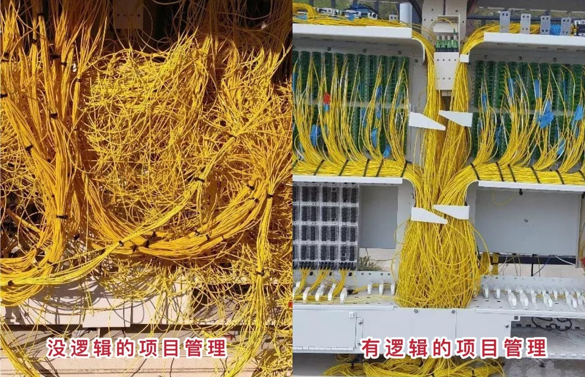
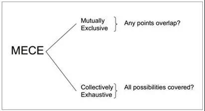
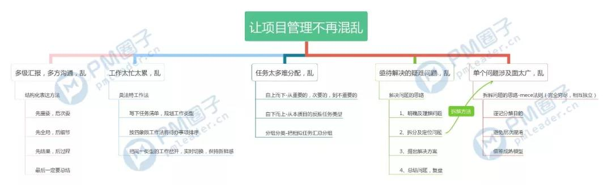

# 工作必备五个逻辑技巧，让项目经理不再爆炸！
工作没有逻辑，做事没有章法，最后导致的结果就是：混乱。

这一点对于每天需要处理大量综合事务的项目经理来说，尤为明显。

逻辑能力薄弱的项目经理会让问题越堆越多，影响自己的工作效率，也影响团队的效率。

当混乱、琐碎，和巨额工作量同时来袭，项目经理只好选择爆炸。

## 爆炸点1

作为团队的救火队员，要解决的问题太多，简直要爆炸！

解决问题的本质，其实是找到现状和目标间的关键障碍，想办法清除障碍。

遵循一定的逻辑步骤，能让解决问题的过程变得清晰明了，而非漫无目的的探索。

解决问题的逻辑技巧如下↓↓

## 爆炸点2

有了解决问题的基本思路，但碰到涉及面过多的综合性问题，还是束手无策。。

碰到庞大难解的复杂问题，需要将其拆解成多个简单的小问题，才能依次解决，各个击破。

拆解问题的标准，要遵循mece法则：相互独立不重复，完全穷尽无遗漏。

拆解问题的逻辑技巧如下↓↓

## 爆炸点3

项目经理需要和多方沟通，每天都说一大堆话，别人却一头雾水压根听不懂，头疼！

你会否碰到这样的情况：想要表达一件很重要的事情，但总感觉无法把重要的内容全部表达出来。

你可能会哀叹自己表达能力太差，但事实上，表达能力的本质，是逻辑能力。

把事情说清楚，你需要结构化表达法↓↓

## 爆炸点4

项目涉及方面太复杂，任务太多太碎不知如何分配，剪不断理还乱，崩溃……

只有项目经理对任务关系有充分认知，对成员能力也充分了解，才能避免因为任务分配不合理，而导致多浪费沟通成本和人力成本的情况。

最简单的方法是找到任务的彼此关系链接线，关系理清楚了，分配逻辑也就清楚了↓↓

## 爆炸点5

工作太忙太累，怎么都休息不够，项目经理最难过的关，不是交付，是体检。。

工作实在太忙，怎么休息都不够，有时候甚至越休息越累。

其实，消极休息会造成压力堆积，想让工作不那么枯燥累人，你需要莫法特工作法↓↓

 

写在最后

逻辑的本质是思维的规则和规律。采用了合适的逻辑技巧，才能事半功倍，远离混乱状态。

以上是工作中比较常用的五个逻辑技巧。但事实上，光掌握几个技巧，远远不够。

对逻辑思维能力的提升之路是无穷无尽的。只有不断学习、反思、复盘，才能真正提升自己的底层逻辑能力，在项目管理中游刃有余。

本文思维导图整理如下↓↓

环环有话说：
以后干货文章末尾将不定期放置
根据文章内容整理的项目管理相关思维导图
大家感兴趣的话请多多关注

拓展阅读 
- [致PM：除了Excel，你还有这五个项目管理软件可以用](http://mp.weixin.qq.com/s?__biz=MzI2NTE3NTgyNA==&mid=2650883745&idx=1&sn=ff4df6f5f86f752bf96aaa0dc7a707f1&chksm=f154b0dec62339c83abd4130e536be875d304420de6d7b5b2752038f6e3040a6a075e64b7694&scene=21#wechat_redirect)
- [拯救PM的六个管理工具](http://mp.weixin.qq.com/s?__biz=MzI2NTE3NTgyNA==&mid=2650883608&idx=1&sn=2368a9d9a16f34ea1c21069d6704158f&chksm=f154b067c6233971e426e77e190a5a8e3c8a8e2083b9cebec69d7140f5f9ad24f04e0f985464&scene=21#wechat_redirect)
- [高薪项目经理压箱底的五个管理逻辑图](http://mp.weixin.qq.com/s?__biz=MzI2NTE3NTgyNA==&mid=2650884037&idx=1&sn=2ce2864d48b57abd7b27c8d9987680a2&chksm=f154b1bac62338ace655702ce2b32f3242f12adc3c59545450c3537a85c48f5d152ec5ca40f0&scene=21#wechat_redirect)