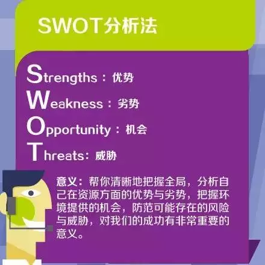
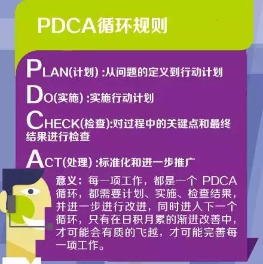
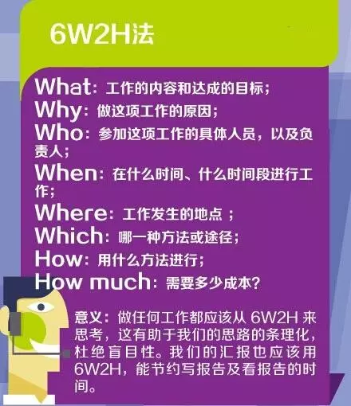
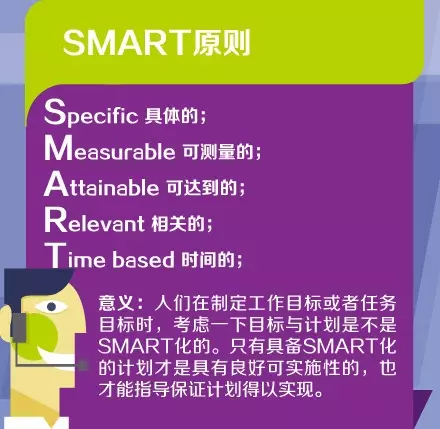

# 7个项目管理工具

# 目录

1. [SWOT分析法](#▋SWOT分析法)
2. [PDCA循环规则](#▋PDCA循环规则)
3. [6W2H法](#▋6W2H法)
4. [SMART原则](#▋SMART原则)
5. [时间管理-重要与紧急](#▋时间管理-重要与紧急)
6. [任务分解法[WBS]](#▋任务分解法[WBS])
7. [二八原则](#▋二八原则)

## ▋SWOT分析法

- Strengths：优势

- Weaknesses：劣势

- Opportunities：机会

- Threats：威胁

>意义：帮你清晰地把握全局，分析自己在资源方面的优势与劣势，把握环境提供的机会，防范可能存在的风险与威胁，对我们的成功有非常重要的意义。

## ▋PDCA循环规则

- Plan：制定目标与计划

- Do：任务展开，组织实施

- Check：对过程中的关键点和最终结果进行检查

- Action：纠正偏差，对成果进行标准化，并确定新的目标，制定下一轮计划

>意义：每一项工作，都是一个pdca循环，都需要计划、实施、检查结果，并进一步进行改进，同时进入下一个循环，只有在日积月累的渐进改善中，才可能会有质的飞跃，才可能取得完善每一项工作，完善自己的人生。

## ▋6W2H法

6W

1. What：工作的内容和达成的目标

2. Why：做这项工作的原因

3. Who：参加这项工作的具体人员，以及负责人

4. When：在什么时间、什么时间段进行工作

5. Where：工作发生的地点

6. Which：哪一种方法或途径

2H

1. How：用什么方法进行

2. How much：需要多少成本

>意义：做任何工作都应该从6W2H来思考，这有助于我们的思路的条理化，杜绝盲目性。我们的汇报也应该用6W2H，能节约写报告及看报告的时间。

## ▋SMART原则

- Specific 具体的

- Measurable 可测量的

- Attainable 可达到的

- Relevant 相关的

- Time based 时间的

### 有的又如此解释此原则

- S代表具体(Specific)，指绩效考核要切中特定的工作指标，不能笼统

- M代表可度量(Measurable)，指绩效指标是数量化或者行为化的，验证这些绩效指标的数据或者信息是可以获得的

- A代表可实现(Attainable)，指绩效指标在付出努力的情况下可以实现，避免设立过高或过低的目标

- R代表现实性(realistic)，指绩效指标是实实在在的，可以证明和观察

- T代表有时限(time bound)，注重完成绩效指标的特定期限

>意义：人们在制定工作目标或者任务目标时，考虑一下目标与计划是不是SMART化的。只有具备SMART化的计划才是具有良好可实施性的，也才能指导保证计划得以实现。

## ▋时间管理-重要与紧急

- A、重要且紧急

    - 紧急状况

    - 迫切的问题

    - 限期完成的工作

    - 你不做其他人也不能做

- B、重要不紧急

    - 准备工作

    - 预防措施

    - 价值观的澄清

    - 计划

    - 人际关系的建立

    - 真正的再创造

    - 增进自己的能力

- C、紧急不重要

    - 造成干扰的事、电话

    - 信件、报告

    - 会议

    - 许多迫在眉捷的急事

    - 符合别人期望的事

- D、不重要不紧急

    - 忙碌琐碎的事

    - 广告函件

    - 电话

    - 逃避性活动

    - 等待时间

    - 优先顺序=重要性*紧迫性

>意义：在进行时间安排时，应权衡各种事情的优先顺序，要学会“弹钢琴”。
对工作要有前瞻能力，防患于未然，如果总是在忙于救火，那将使我们的工作永远处理被动之中。

## ▋任务分解法[WBS]

即Work Breakdown Structure，如何进行WBS分解：目标→任务→工作→活动

WBS分解的原则：

- 将主体目标逐步细化分解，最底层的任务活动可直接分派到个人去完成；每个任务原则上要求分解到不能再细分为止。

WBS分解的方法：

- 至上而下与至下而上的充分沟通

- 一对一个别交流

- 小组讨论

WBS分解的标准：

- 分解后的活动结构清晰

- 逻辑上形成一个大的活动

- 集成了所有的关键因素包含临时的里程碑和监控点

- 所有活动全部定义清楚

>意义：项目经理要学会分解任务，只有将任务分解得足够细，你才能心里有数，才能有条不紊地工作，统筹安排你的时间表。

## ▋二八原则

巴列特定律：“总结果的80%是由总消耗时间中的20%所形成的。” 按事情的“重要程度”编排事务优先次序的准则是建立在“重要的少数与琐碎的多数”的原理的基础上。

>意义：这启示我们在工作中要善于抓主要矛盾，善于从纷繁复杂的工作中理出头绪，把资源用在最重要、最紧迫的事情上。

工具虽然重要，但我们也要记住，所有的工具，只有在对的时间，用在对的地方，才能真正指导项目经理的实际工作。

希望我们都能用好每一个工具，加油鸭！